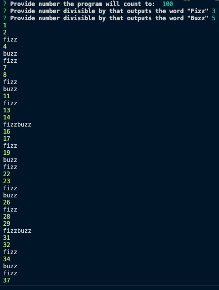

# FizzBuzzPractice

"Write a program that prints the numbers from 1 to 100. But for multiples of three print Fizz instead of the number and for the multiples of five print Buzz. For numbers which are multiples of both three and five print FizzBuzz."

fizzbuzz1.js

- Simple for loop that if run using "node fizzbuzz1.js" will output the numbers sequentially and print out fizz for all numbers divisible by 3, buzz for all numbers divisible by 5 and fizzbuzz for all numbers divisible by both.

fizzbuzz2.js

- Installed [npm package Inquirer](https://www.npmjs.com/package/inquirer) in order to prompt the user to input fields for the program

**Prompts and Results:**

